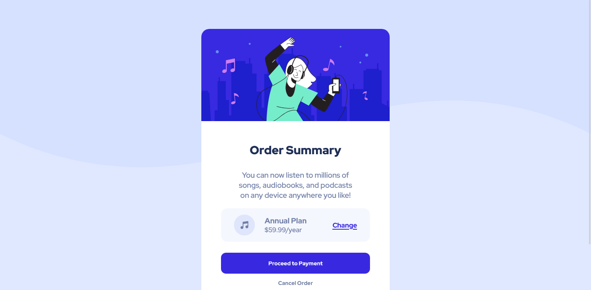

# Frontend Mentor - Order summary card solution

This is a solution to the [Order summary card challenge on Frontend Mentor](https://www.frontendmentor.io/challenges/order-summary-component-QlPmajDUj). Frontend Mentor challenges help you improve your coding skills by building realistic projects. 

# View Live Page Here
 	[Order Summary Card live - Site Url Gitub](https://neomill.github.io/order-summary-component-solution/)

## Table of contents

- [Overview](#overview)
  - [The challenge](#the-challenge)
  - [Screenshot](#screenshot)
  - [Links](#links)
- [My process](#my-process)
  - [Built with](#built-with)
  - [What I learned](#what-i-learned)
  - [Continued development](#continued-development)
- [Author](#author)


## Overview

### The challenge

- Transition for buttons: change annual plan, proceed to payment, cancel order (i didn't use transition property before)

- You have to guess the size of the fonts, margins, paddings, widths, heigth, etc.( I dont have a premium plan to have figma files,)

### Screenshot
Web Version (Sshot on 1440 height viewport)


Mobile Version (Sshot on 375 height viewport)


### Links

- Solution URL: [Add solution URL here](https://github.com/Neomill/order-summary-component-solution)
- Live Site URL: [Add live site URL here](https://neomill.github.io/order-summary-component-solution/)

## My process

### Built with

- Semantic HTML5 markup
- CSS custom properties
- Flexbox
- Web-first workflow

### What I learned

I learned about proper HTML markup.

Since this project requires button transition. I research for that property deeply.

I learned about Media Queries, Though i know some of media queries, this project help me to dont overuse media queries, that there are only some certain breakpoints.

I also discoverd that with the use of the code below:

```css
.main {
  min-height: 100vh;
}
```
**Note: .main is a main tag that is a direct child of the body**
 the bug when viewport is "smaller to the page, it crops the page and leave white space when scrolling down" was fixed. This also set the html and body height to 
 the entire page without defining their height. Even if the viewport's height is smaller than the page the page render corretly.


### Continued development

I would like to research about responsive design, as this is an in demand topic on css. This will also help me building responsice webpage at ease, as this is what I 
am passionat about.


## Author

- Github - [Neomill](hhttps://github.com/Neomill)
- Frontend Mentor - [@neomill](https://www.frontendmentor.io/profile/Neomill)
- Gmail - [Neomill Marc Reas](rneomillmarc@gmail.com)

